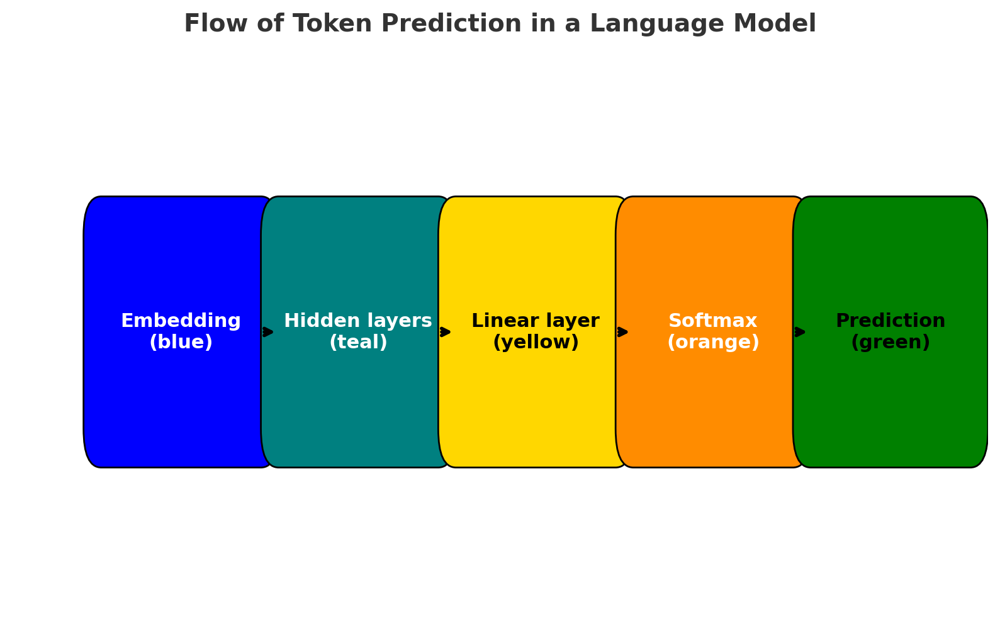

Final prediction layer of a language model
===
<h4>line of code below is an important part of how a language model generates words/tokens</h4>
<code> self.fc = nn.Linear(hidden_size, vocab_size)</code>

1. <b>in_features = hidden_size</b>
→ the number of neurons in the hidden representation (the size of the vector output by your model’s encoder/transformer/hidden state).

2. <b>out_features = vocab_size</b>
→ the number of possible tokens in your vocabulary (all the words, characters, or subwords your model can predict).

So this layer <b>maps from the model’s hidden state → to a probability distribution over the vocabulary.</b>

--------------------------

Why is this needed in a Language Model?
=====

1. Inside the network (RNN, Transformer, etc.), you work with hidden states (e.g. vectors of size 128, 256, etc.).
These don’t directly correspond to words.

2. At the end, you need to predict the next token from your vocabulary. <b>Example:</b>

    1. Hidden vector size = 128
    2. Vocabulary size = 10,000 words
    3. You need to map 128 → 10,000

3. The nn.Linear(hidden_size, vocab_size) does exactly that mapping.
4. After this, you usually apply a softmax:
    1. logits → raw scores for each token in vocab
    2. softmax(logits) → converts them into probabilities

But, no softmax in this rnn model! why?

----
1. Training efficiency

    PyTorch has a special loss function:
<code>nn.CrossEntropyLoss()</code>
It expects raw logits (not softmaxed probabilities).

2. Internally, it applies <b>log-softmax + NLLLoss</b> in one step → more stable numerically.

If we applied softmax in the model, we’d be doing extra unnecessary work.

✅ <b>Summary</b>

1. TinyLM ends with nn.Linear(hidden_size, vocab_size).

2. No softmax inside the class → because nn.CrossEntropyLoss already expects logits.

3. You apply torch.softmax (or argmax) outside when you need probabilities or predictions.

